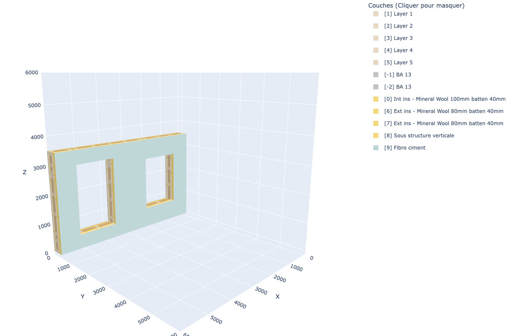
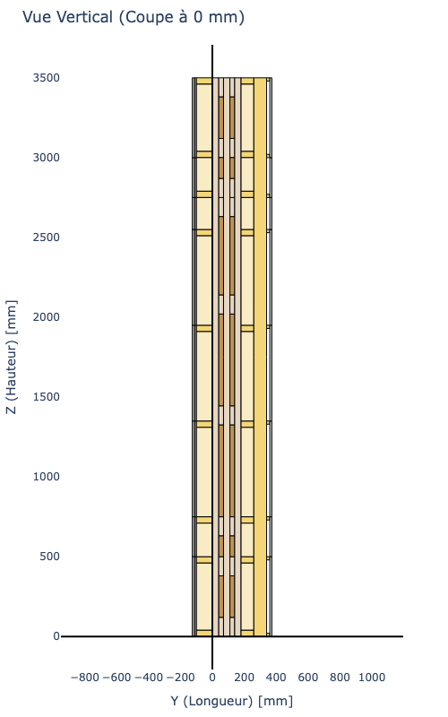
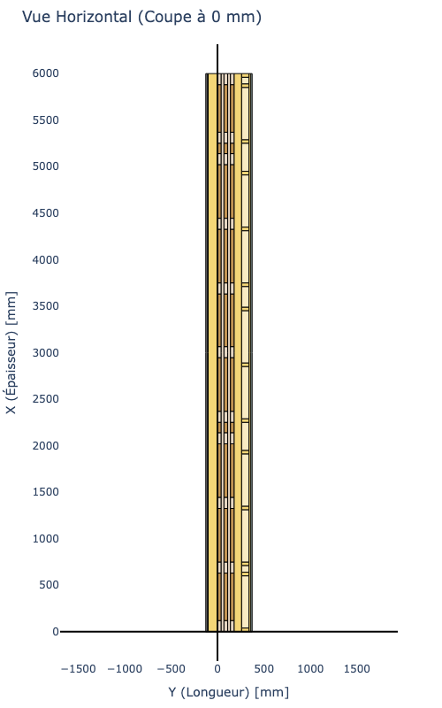

# AEC Computational Platform

**A personal R&D repository exploring the intersection of BIM data, Computational Geometry, and Engineering Physics.**

The goal of this project is to bridge the gap between standard design tools (Rhino, Speckle) and advanced engineering analysis (Python). Instead of treating walls as simple 3D geometry, this platform converts them into intelligent `WallBuildUp` objects to simulate their physical performance and generate fabrication data.

---

## 🔄 The Workflow

The architecture is strictly divided into 3 functional blocks:

### 1. Connectors (Input)
Bridges to external software. I don't model manually here; I pull data from **Speckle**, **Rhino**, or **IFC**.
*   **Role:** Normalize raw geometry into the Core format.

### 2. Core (Pivot)

The heart of the system. Once ingested, raw geometry acts as a seed to generate a semantic `WallBuildUp` object. 

This module acts as the **Single Source of Truth**, decoupling the input source (Rhino/Revit) from the analysis solvers. It enforces a strict physical architecture based on construction logic rather than just geometric layers:

*   **External Layers:** Weather protection & thermal envelope (defined relative to the structure's outer face).
*   **Structural Core:** The load-bearing reference (Lattice, CLT, or Concrete).
*   **Internal Layers:** Service cavities & finishes (defined relative to the structure's inner face).

<!-- GALERIE D'IMAGES - Remplace les liens src par tes noms de fichiers -->
<table border="0">
  <tr>
    <td width="33%" align="center">
      
       
      <em>The Structural Core</em>
    </td>
    <td width="33%" align="center">
      
       
      <em>Int/Ext Separation</em>
    </td>
    <td width="33%" align="center">
      
       
      <em>WallBuildUp Object</em>
    </td>
  </tr>
</table>

### 3. Solvers (Output)
Engines that consume the Core object to generate results.
*   **Physics Solvers:** Acoustics ($R_w$), Thermal ($U-value$), Carbon ($CO_2$).
*   **Fabrication Solvers:** Cutting lists (BOM), Assembly guides.

---

## 📂 Repository Structure
<pre>
aec-computational-platform/
├── connectors/           # [INPUT] Bridges to external software
│   ├── speckle.py
│   └── rhino.py
│
├── core/                 # [PIVOT] Standardized Python Objects
│   ├── elements.py       # WallBuildUp Class definition
│   └── materials.py      # Physical Material Database
│
└── solvers/              # [OUTPUT] Analysis & Fabrication Engines
    ├── physics/          # Design Analysis
    │   ├── acoustics/    # Sound (Rw) / ISO 10140 Simulation & Visualization
    │   └── thermal/      # Heat transfer calculation (U-value)
    └── production/       # Construction Analysis
        ├── fabrication/  # Cutting lists (BOM)
        └── logistics/    # Lifting weight & COG
</pre>
