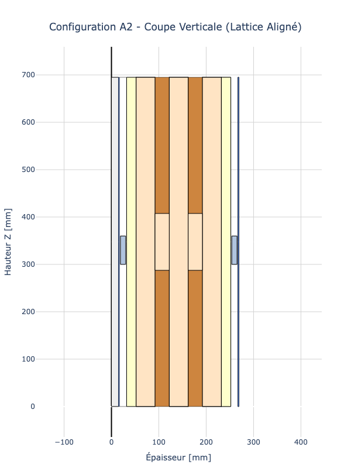
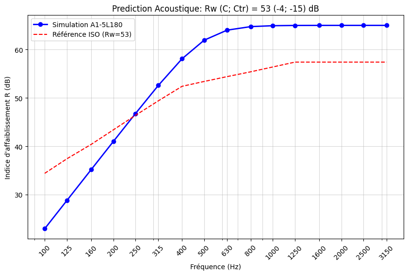

# 🔊 Acoustic Solver (Sound Reduction Index $R_w$)

This module provides physics-based simulations for the **Sound Reduction Index ($R_w$)** of building elements.
It bridges the gap between theoretical Mass Laws (Concrete/CLT) and complex Mass-Spring-Mass systems (Lattice Structures).

<!-- DUAL IMAGE DISPLAY -->
<table border="0" width="100%">
  <tr>
    <td width="45%" align="center">
      
       
      <em>Fig 1. Lattice Buildup Model (Mass-Spring-Mass)</em>
    </td>
    <td width="55%" align="center">
      
       
      <em>Fig 2. Rw Simulation Results vs ISO Standards</em>
    </td>
  </tr>
</table>

## 🎯 The Lattice Challenge

Unlike monolithic materials (Concrete, CLT) which follow a linear Mass Law, the **Lattice system** behaves as a sophisticated **Mass-Spring-Mass** oscillator.

*   **The Problem:** Standard acoustic engineering software often penalizes lightweight structures due to a lack of specific test data, applying large safety factors.
*   **The Solution:** This solver implements the **Sharp Model** (Double Leaf) calibrated on real lab tests (ISO 10140), allowing us to predict performance for custom thicknesses without re-testing.

> "We do not suffer from the lightness of wood; we leverage it through engineering (decoupling)."

## 📚 Applicable Standards

This module is built upon the strict physical framework of European Standards:

### 1. Lab Measurement (Input Data)
*   **ISO 10140-2:** Measurement of airborne sound insulation ($R_w$). *Used for calibration.*
*   **ISO 717-1:** Rating of sound insulation in buildings. *Used to calculate the single number quantity $R_w (C ; C_{tr})$ from the spectral curve.*

### 2. Prediction Models (The Python Code)
*   **ISO 12354-1:** Building performance estimation from elements ($R'_{w} \approx R_{wall} - \text{Flanking}$).
*   **Mass-Spring-Mass Theory (Sharp):** Used to model the resonance frequency ($f_0$) and the decoupling efficiency of the lattice ribs.

### 3. French Regulation (The Target)
*   **NRA 2000 (Arrêté du 30 juin 1999):**
    *   Target: $D_{nT,A} \ge 53 \text{ dB}$ (Airborne between apartments).
    *   Lattice Wall Simulation: **$R_w = 61 \text{ dB}$** (Safety margin > 8 dB).

## 🛠️ Usage

The solver is available as a standalone Jupyter Notebook for R&D analysis.

### Features
1.  **Multi-Model Support:** Automatically selects `Mass Law` (Concrete/CLT) or `Sharp Model` (Lattice) based on input topology.
2.  **ISO 717-1 Rating:** Auto-calculates $C$ and $C_{tr}$ adaptation terms.
3.  **Visual Comparison:** Overlay plots to benchmark against standard construction methods.

### Example Output
System: Lattice Structure 180 (5-Layers)
Rw (C ; Ctr) = 53 (-4 ; -15) dB

## Roadmap

*   **Phase 1 (Current):** Reliability. Calibration of the Python script against existing Lab Reports.
*   **Phase 2 :** Flanking Transmission. Incorporating $K_{ij}$ vibration reduction indices for junction nodes (ISO 12354-1).

