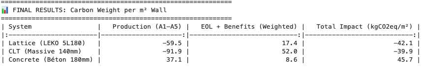
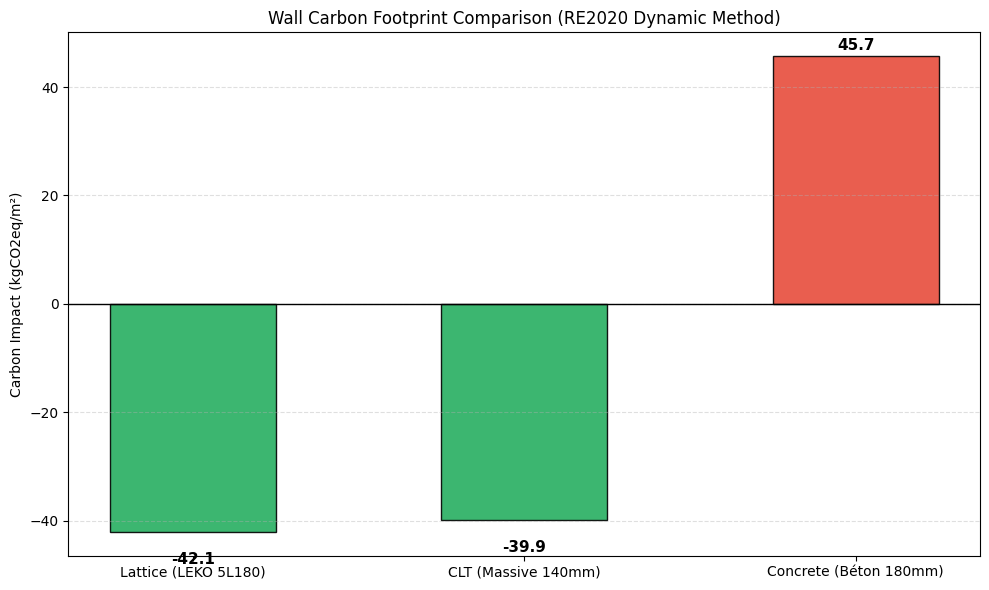
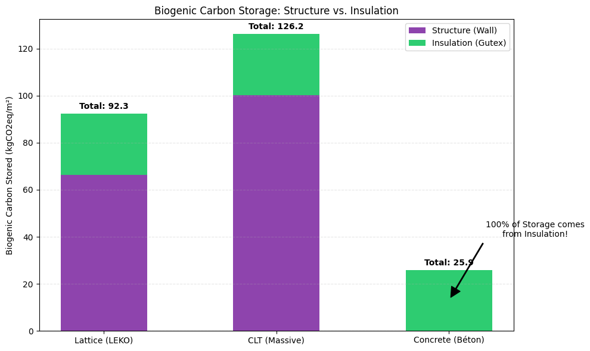

# 🌍 Carbon Footprint Assessment (RE2020)

This module evaluates the **Environmental Performance** of the Lattice System compared to conventional wall assemblies (Concrete, CLT).
The assessment strictly follows the **RE2020 Dynamic Life Cycle Assessment (LCA)** methodology, using certified **INIES FDES** data.

## 1. Methodology (RE2020 Standard)

The core metric is the **Carbon Weight** ($kgCO_{2}eq/m^2_{wall}$), calculated dynamically over a 50-year period.

$$ \text{Carbon Weight} = \sum (A1...A5) + 0.578 \times \sum (C1...C4 + D) $$

*   **A1-A5 (Production):** Emissions released immediately (Manufacturing, Transport, Installation).
*   **C1-C4 (End of Life):** Future emissions, weighted by a dynamic factor ($0.578$).
*   **Module D (Benefits):** Recycling potential and biogenic carbon credits (negative values = good).

## 2. Key Results: Carbon Weight Comparison

The goal is to determine the net environmental impact of 1 m² of wall.

### Performance Summary
The Lattice system achieves the best score thanks to its **Material Efficiency** (low production impact) combined with biogenic storage.

<!-- RESULT TABLE IMAGE -->

  
   <em>Fig 1. Detailed Carbon Weight Calculation (RE2020)</em>

### Comparative Analysis
*   **Lattice (-42.1 kgCO2):** Excellent score. The low quantity of wood required (-60 kgCO2 prod) is sufficient to offset emissions, resulting in a **Carbon Negative** wall.
*   **CLT (-39.9 kgCO2):** Very good score. However, its massive wood volume induces a higher production impact (-91 kgCO2) compared to Lattice, slightly reducing its efficiency per m².
*   **Concrete (+45.7 kgCO2):** Poor score. The positive production impact (+37 kgCO2) cannot be compensated by the insulation alone.

<!-- RE2020 IMPACT CHART -->

  
   <em>Fig 2. Net Carbon Impact per Wall System (Lower is Better)</em>

---

## 3. Biogenic Carbon Storage (The "Forest Effect")

Beyond the regulatory calculation, it is crucial to understand **where** the carbon is stored.
The **Biogenic Carbon** represents the CO2 captured by the trees during their growth.

### Structure vs. Insulation Contribution
This breakdown reveals the true nature of the materials:

*   **Lattice:** Balanced storage. The structural skeleton and the wood fibre insulation both contribute significantly.
*   **CLT:** Massive structural storage (~100 kgCO2/m²). It acts as a carbon vault but consumes more resource.
*   **Concrete:** **Zero structural storage.** The only carbon stored comes from the external wood fibre insulation (Gutex). Without it, the wall would store nothing.

<!-- BIOGENIC BREAKDOWN CHART -->

  
   <em>Fig 3. Biogenic Storage by Layer (Structure vs. Insulation)</em>

## 🛠️ Usage

The analysis is performed in the Jupyter Notebook `carbon_re2020.ipynb`.
It requires the `db_carbon.xlsx` file containing the FDES data extracts.

