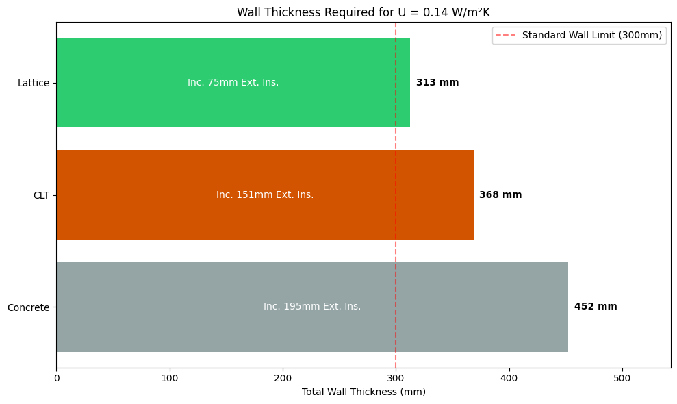
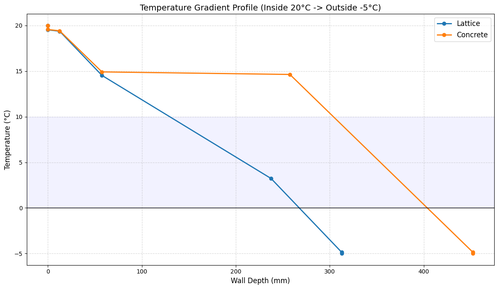
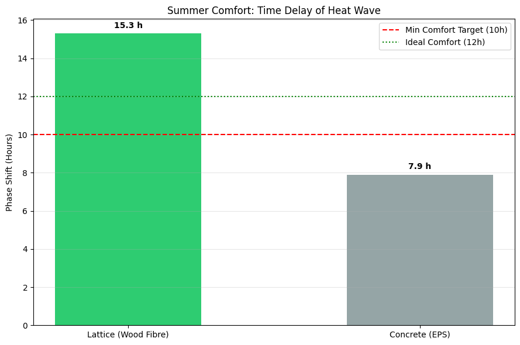
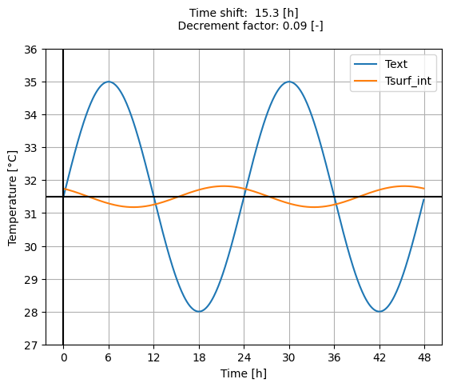

# 🌡️ Thermal Analysis Module

This module evaluates the **Building Envelope Performance** of the Lattice System compared to standard construction methods (Concrete, CLT).
It covers both **Winter Performance (Static)** and **Summer Comfort (Dynamic)**, adhering to ISO standards.

## 1. Static Analysis (Winter Performance)
**Standard:** ISO 6946 (Combined Method for Inhomogeneous Layers).

The goal is to determine the wall thickness required to reach the **Passive House Standard ($U \le 0.15 W/m^2K$)**.

### Key Findings
*   **Efficiency:** The Lattice system's structural core is inherently insulating ($\lambda_{eq} \approx 0.05$).
*   **Space Saving:** To achieve $U=0.14$, the Lattice wall is **100mm thinner** than a standard Concrete wall.

<!-- STATIC IMAGES -->
<table border="0" width="100%">
  <tr>
    <td width="50%" align="center">
      
       <em>Fig 1. Thickness Optimization (Target U=0.14)</em>
    </td>
    <td width="50%" align="center">
      
       <em>Fig 2. Temperature Gradient Profile</em>
    </td>
  </tr>
</table>

> **Fig 2 Analysis:** The Concrete wall (Orange) shows no thermal resistance until the external insulation layer, creating a "cold shell". The Lattice wall (Blue) provides consistent insulation throughout its depth.

---

## 2. Dynamic Analysis (Summer Comfort)
**Standard:** ISO 13786 (Matrix Transfer Method).

With heat waves becoming more frequent, **Phase Shift ($\phi$)** is critical. It measures the time delay between the peak outside temperature and the peak inside temperature.

### Comparison: Lattice vs. Concrete
We compare the Lattice system (filled with high-density Wood Fibre) against a standard Concrete wall with EPS insulation.

| System | Phase Shift ($\phi$) | Decrement Factor ($f$) | Comfort Rating |
| :--- | :--- | :--- | :--- |
| **Lattice System** | **15.3 hours** | **0.09** | 🟢 Excellent |
| **Concrete (EPS)** | 7.9 hours | 0.13 | 🔴 Poor |

<!-- DYNAMIC IMAGES -->
<table border="0" width="100%">
  <tr>
    <td width="50%" align="center">
      
       <em>Fig 3. Phase Shift Comparison</em>
    </td>
    <td width="50%" align="center">
      
       <em>Fig 4. Heat Wave Damping (Sinusoidal Simulation)</em>
    </td>
  </tr>
</table>

### Physics Behind the Result
The superior performance of the Lattice system is driven by the **Specific Heat Capacity ($c_p$)** of the materials:
*   **Wood Fibre:** $c_p \approx 2100 J/kg.K$ (Stores heat efficiently).
*   **EPS (Polystyrene):** $c_p \approx 1450 J/kg.K$ but with very low density ($15 kg/m^3$), resulting in negligible thermal inertia.

## 🛠️ Usage

The analysis is split into two Jupyter Notebooks:
1.  `static_u_value.ipynb`: U-Value optimization and condensation risk.
2.  `summer_comfort.ipynb`: Dynamic thermal simulation using `becalib`.

